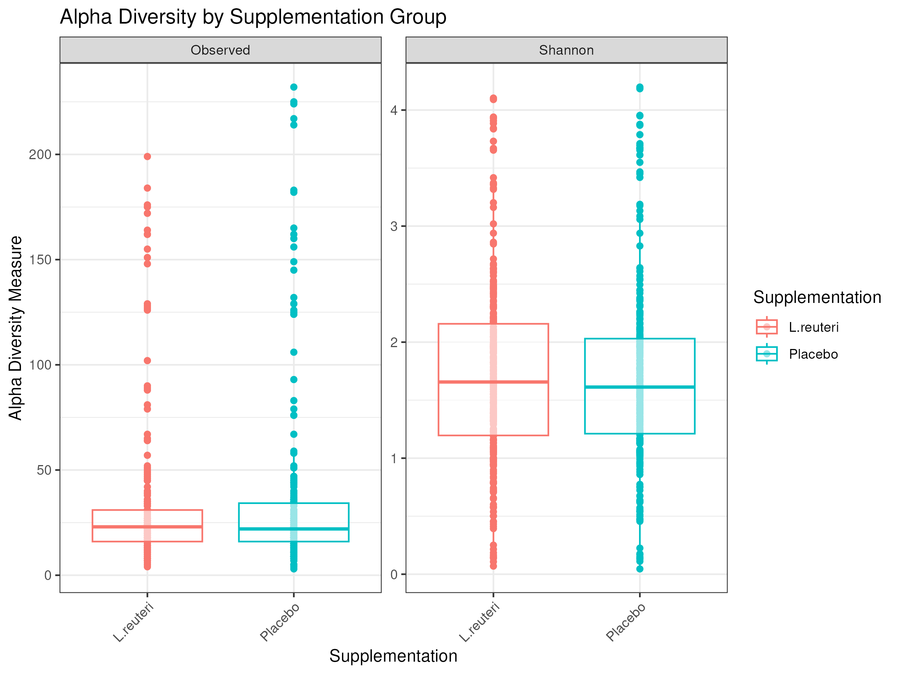
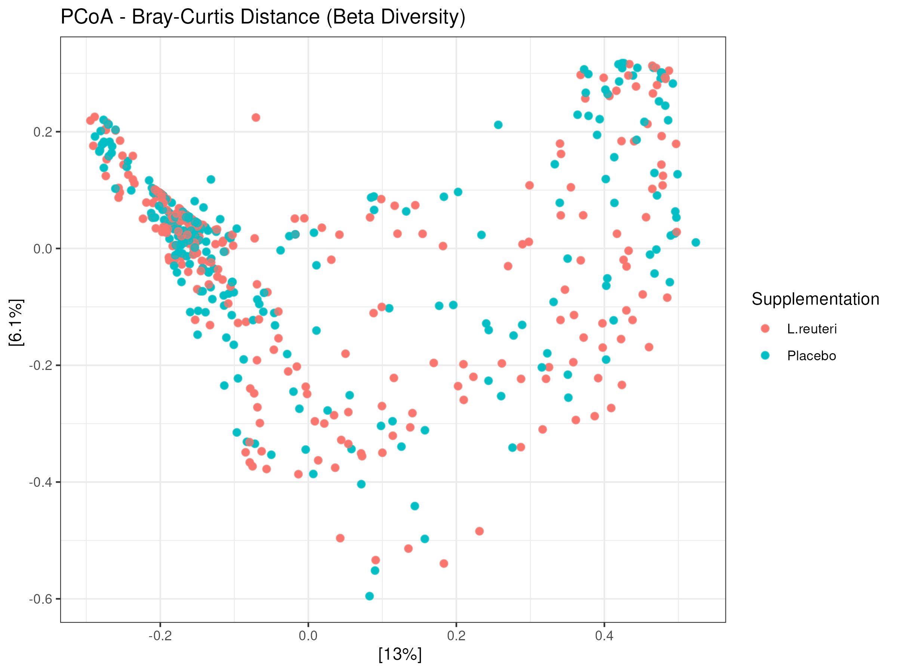
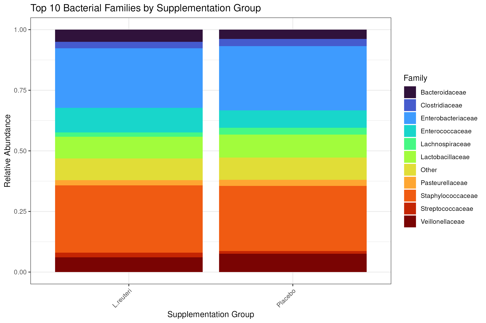
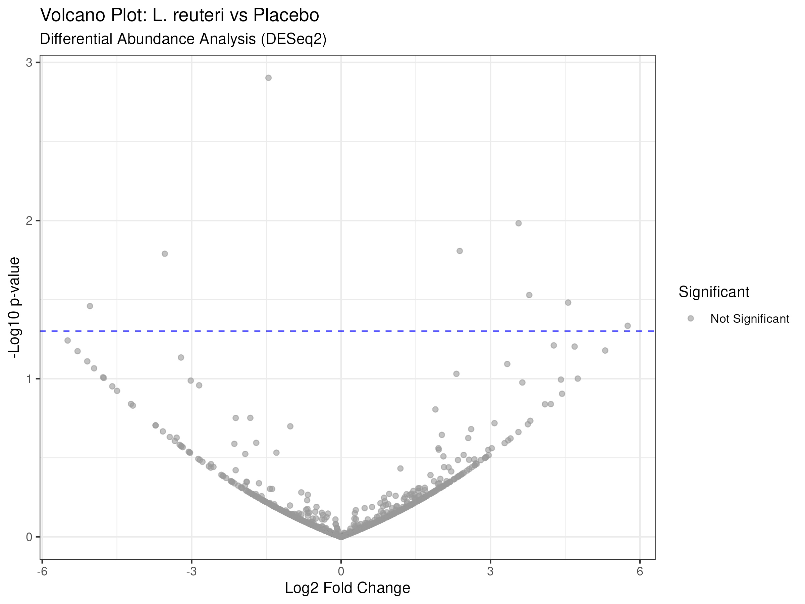

# 🧬 Microbiome Bioinformatics & Ecological Analysis Pipeline: L. reuteri Supplementation in Preterm Infants

## 📋 Project Overview
This repository contains a comprehensive bioinformatics and statistical analysis pipeline for 16S rRNA gene amplicon sequencing data. The project investigates the impact of daily supplementation with **_Lactobacillus reuteri_ DSM 17938** versus **Placebo** on the gut microbiota of extremely low birth weight (ELBW; <1000 g) preterm infants during the first month of life ( derived from the **PROPEL-16S** clinical trial).

---

## 🔬 Dataset Summary
* **Target Cohort:** Extremely low birth weight preterm infants.
* **Intervention:** _L. reuteri_ DSM 17938 vs. Placebo (from birth to Post-Menstrual Week 36).
* **Sequencing Depth:** 558 quality-filtered stool samples.
* **Feature Table:** 6,013 Amplicon Sequence Variants (ASVs) generated via DADA2.
* **Taxonomic Database:** SILVA v138.1.

---

## 📂 Pipeline Architecture (Jupyter Notebooks)
The analysis is structured into sequential, reproducible Jupyter Notebooks executed within an Azure HPC Apptainer container (`dada2.sif`):
1. **`01_data_acquisition.ipynb`**: Automated download and verification of raw sequencing reads.
2. **`02_Quality Control & Preprocessing.ipynb`**: Quality filtering, trimming, and Cutadapt primer removal.
3. **`03_DADA2_ASV_Inference.ipynb`**: Error rate learning, sample inference, chimera removal, and ASV table construction.
4. **`04_Assignment Taxonomy.ipynb`**: Taxonomic classification against the SILVA database.
5. **`05_Phyloseq.ipynb`**: Integration of ASV tables, taxonomy, and `master_metadata_final.tsv` into a unified Phyloseq object.
6. **`06_Downstream Analysis.ipynb`**: Alpha diversity, Bray-Curtis Beta diversity (PCoA), PERMANOVA testing, and Taxonomic composition barplots.
7. **`07_Differential Abundance Analysis (DESeq2).ipynb`**: Granular differential abundance testing using DESeq2 and Volcano plots.

---

## 📊 Key Results & Visualizations

### 1. Alpha Diversity
* Evaluated via Observed richness and Shannon index. Shows high baseline consistency across treatment groups.
* **Figure:** 

### 2. Beta Diversity & PERMANOVA
* Evaluated via Bray-Curtis distance PCoA ordination. PERMANOVA statistical test ($p = 0.143$, $R^2 = 0.002$) indicates no broad global community-wide structural shift between the probiotic and placebo groups overall.
* **Figure:** 

### 3. Taxonomic Composition (Top 10 Families)
* Stacked relative abundance barplots illustrating the dominant bacterial families across study arms.
* **Figure:** 

### 4. Differential Abundance (DESeq2)
* Granular Wald test using the `poscounts` estimator. No individual ASVs crossed the strict false discovery rate threshold ($padj < 0.05$), confirming microbial community resilience at the individual taxon level.
* **Figure:** 

---

## 💡 Scientific Conclusion & Ecological Insight

While broad ecosystem metrics (Alpha/Beta diversity and DESeq2 differential abundance) did not display widespread macro-level shifts between the L. reuteri and Placebo arms across the dataset (PERMANOVA p=0.143), this highlights a profound biological insight: **High Microbial Community Resilience**. 

Rather than undergoing a disruptive structural collapse (such as the loss of entire evolutionary branches seen in severe pathological dysbiosis), the infant gut microbiome demonstrates a stable, adaptive capacity—successfully integrating the beneficial probiotic strain while preserving its core structural signature.

---